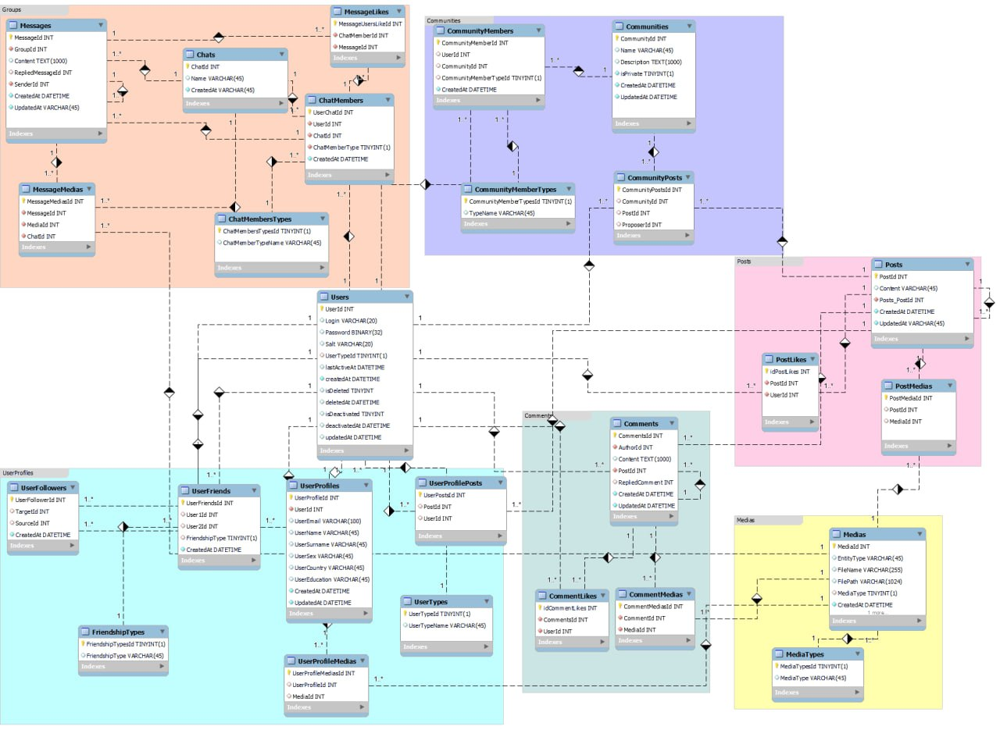

# Social-Network API

This project is an API for a social network platform, providing functionality for users, friends, communities, chats, posts, and media management.

## API Endpoints

You can find the detailed API documentation and endpoints on the [Swagger Page](https://your-swagger-page-url).

## Database Schema

